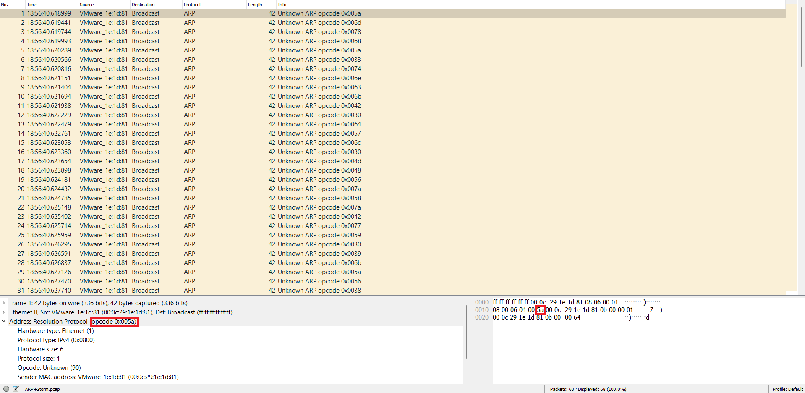
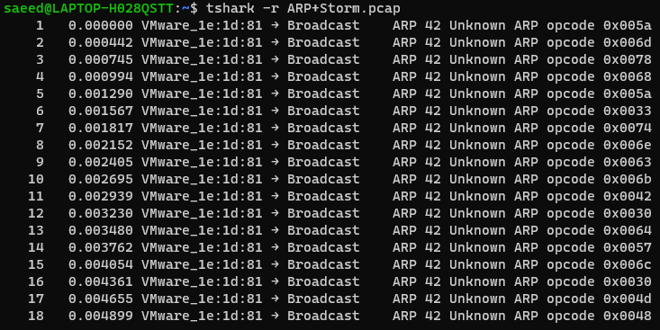
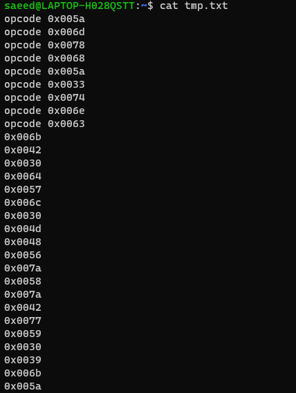
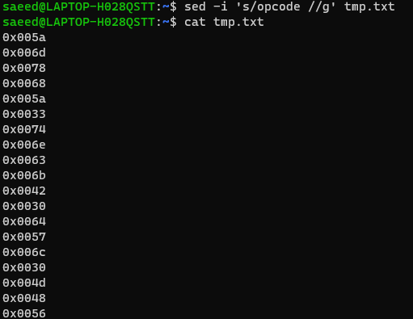

# ARP Storm Description
An attacker in the network is trying to poison the arp table of 11.0.0.100, the admin captured this PCAP.

# Steps
- Donwnload *.pcap file

        curl -O https://hubchallenges.s3-eu-west-1.amazonaws.com/Forensics/ARP+Storm.pcap

- Open the file using wireshark. It will look like the following:

- You will notice that the only filed changing is the opcode field
    > we need only to extract that field and look about it
- Use the ``tshark`` command to dump the traffic

         tshark -r ARP+Storm.pcap
    
    you will find something like this:

    

- Extract the opcode field using the ``cut`` command with space delimiter and field number

        tshark -r ARP+Storm.pcap | cut -d ' ' -f 19,20 > tmp.txt
    
    it will look like this:

    

    > we need to remove the opcode word

- Remove opcode using ``sed`` command

        sed -i 's/opcode //g' tmp.txt

    

- Convert this hex values to readable text using ``xxd`` command

        cat tmp.txt | xxd -r -p

        ZmxhZ3tnckB0dWl0MHVzXzBwY09kZV8xc19BbHdAeXNfQTZ1U2VkX3QwX3AwMXMwbn0=

- It seems like base64 so conver it

        echo ZmxhZ3tnckB0dWl0MHVzXzBwY09kZV8xc19BbHdAeXNfQTZ1U2VkX3QwX3AwMXMwbn0= | base64 -d

    **Conguratulations!** here's the flag:

        flag{gr@tuit0us_0pcOde_1s_Alw@ys_A6uSed_t0_p01s0n}